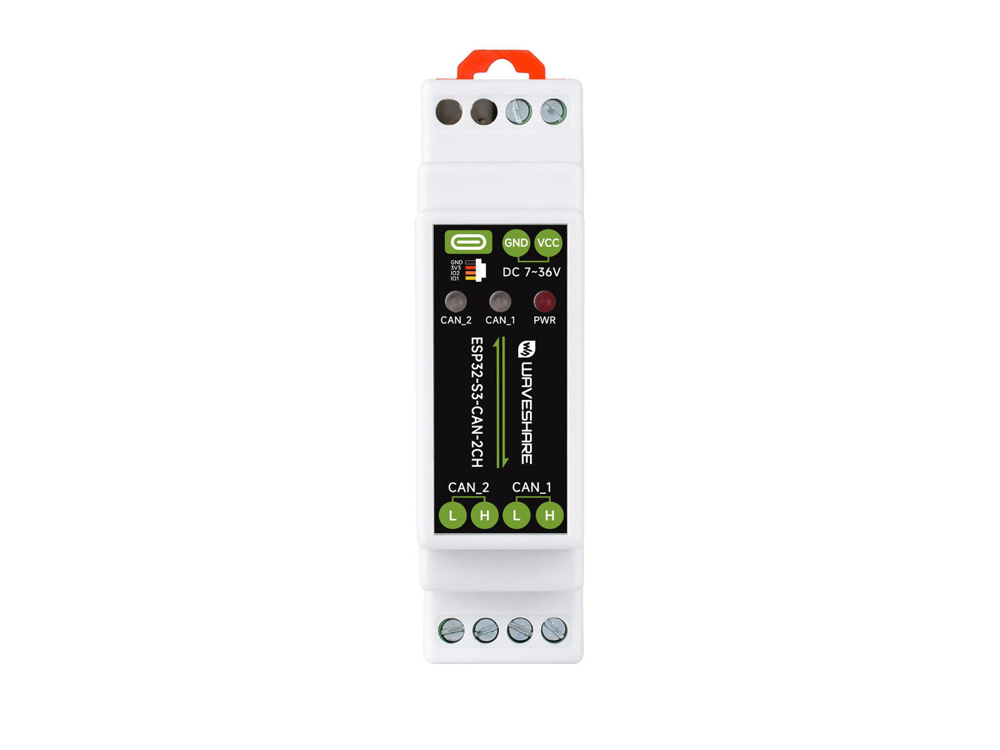

# Waveshare ESP32-S3-CAN-2CH

[English](README.md)

ESP32-S3-CAN-2CH 是一款微雪 (Waveshare) 设计的低成本、高性能双路 CAN 微控制器开发板。板载两路隔离 CAN 接口、RTC、USB Type-C、UART 与 20Pin 扩展接口，适合 CAN 总线调试、工业通信、车载电子和物联网网关等场景。

- [购买链接](https://www.waveshare.net/shop/ESP32-S3-CAN-2CH.htm)
- [产品文档](https://docs.waveshare.net/ESP32-S3-CAN-2CH/)



## 仓库结构

本仓库提供 ESP32-S3-CAN-2CH 的示例程序、Arduino 库、出厂固件和硬件设计文件。

```
.
├── assets/                # README 使用的产品图片
├── examples/              # 示例程序
│   ├── Arduino/           # Arduino 示例与内置库
│   └── ESP-IDF/           # ESP-IDF 工程
├── firmware/              # 预编译出厂固件（.bin）
├── hardware/              # 原理图、引脚图和尺寸图
└── HARDWARE_REFERENCE.md  # 硬件速查文件
```

## 快速开始

预编译固件位于 [`firmware/`](firmware)。构建环境、烧录步骤、引脚映射及配置说明请参阅[产品文档页面](https://docs.waveshare.net/ESP32-S3-CAN-2CH/)。

如需面向开发者和 AI 编程工具的结构化硬件速查（涵盖板载外设、GPIO 分配、I2C 地址和扩展接口信号），请参考 [HARDWARE_REFERENCE_ZH.md](HARDWARE_REFERENCE_ZH.md)。

## 贡献

我们欢迎您的贡献！您可以通过以下方式提供帮助：

1. Fork 本仓库。
2. 为您的新功能或 Bug 修复创建一个新分支。
3. 提交您的更改并附上清晰的描述。
4. 提交 Pull Request 以供审核。

## 问题与支持

请创建 [Issue](https://gitee.com/waveshare/ESP32-S3-CAN-2CH/issues) 并提供详细信息，或联系微雪团队并提供订单号以获取技术支持。

## 许可

本仓库遵循 Apache License 2.0 许可。详情请参阅 [LICENSE](LICENSE) 文件。

---

感谢您使用微雪电子产品！🚀
